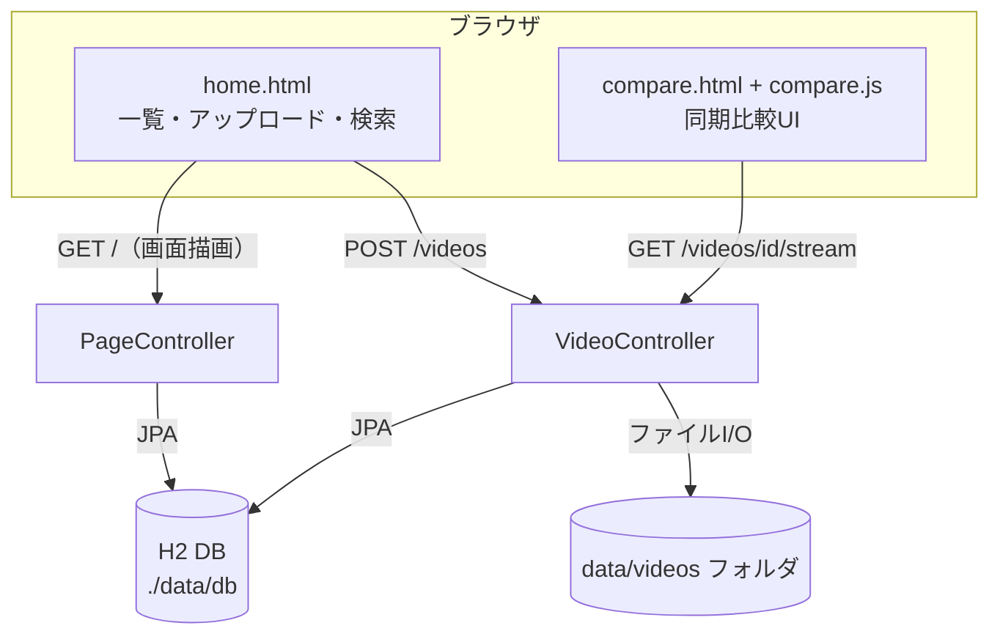

# 格ゲー技比較ツール（Java + Spring Boot版）

## 1. この作品について（開発の経緯・動機）

格闘ゲームの「見た目が似ている技」は、発生タイミングの差が数フレーム（1/60秒単位）しかなく、目視では区別しづらいという課題がありました。
まず HTML + JavaScript だけで動く単体版を作って「フレーム同期比較」の考え方を検証し、その後、ポリテクで学習中の **Java（Spring Boot）** によるサーバー保存版として作り直したのが本作品です。

- **HTML単体版**：ブラウザ内だけで完結（サーバー不要）。だれがすぐ試せるかを優先
- **本作品（Java版）**：録画動画をサーバーに保存し、ページをまたいで利用できるのが特徴。業務で一般的な「Webアプリ + DB + ファイル保存」の構成を学習目的で再現

## 2. 実装した機能

| 機能 | 詳細 |
|---|---|
| 動画アップロード | WebM/MP4 を受信し、UUIDファイル名で保存（`MultipartFile`） |
| 動画リスト | 一覧表示（名前・サイズ・日時）。DBから取得してThymeleafで描画 |
| タイトル検索 | 動画名の部分一致検索（`findByNameContainingIgnoreCase`） |
| 比較ページ | 選択した2本（A/B）を横並びで同時比較 |
| 同期点＋確定 | シークバーで止めた位置を候補にし、±1f／±3fで微調整→「確定」で緑表示 |
| 同時再生・同期補正 | 共通タイムラインで2本を再生し、60msごとにズレを自動補正 |
| 一時停止／最初から再生 | 現在位置から再開／同期点へ戻してやり直し |
| 自動・手動コマ送り | 指定秒ごとに1フレーム進むスロー再生／±1f・±3f・←→キー |
| ループ再生 | ループ区間（秒）ごとに同期点へ戻って繰り返し |
| 動画配信 | Rangeリクエスト対応（シークバーが正しく動く理由） |
| 削除 | DBレコードと実ファイルの両方を削除 |
| 同期点の永続化 | localStorageに動画ごとに保存（再訪時も再現） |

## 3. システム構成図



- 言語: **Java 21**（ポリテクで学習中の言語）
- フレームワーク: **Spring Boot 3.3**（Web / Thymeleaf / Data JPA）
- DB: **H2**（Java内蔵・ファイル永続化。MySQL不要）
- 画面: Thymeleaf + HTML/CSS/JavaScript

## 4. ソースコード構成

| ファイル | 役割 |
|---|---|
| `KakugeApplication.java` | 起動クラス（`SpringApplication.run`） |
| `Video.java` | エンティティ（videosテーブル。id/名前/ファイル名/サイズ/日時） |
| `VideoRepository.java` | DAO相当。`JpaRepository`継承でSQLを書かずにCRUD |
| `PageController.java` | 画面を返すコントローラ（`/` 一覧・検索、`/compare` 比較画面） |
| `VideoController.java` | データ操作（`POST /videos` アップロード、`POST /videos/{id}/delete`、`GET /videos/{id}/stream` 配信） |
| `templates/home.html` | 一覧・アップロード・検索画面（Thymeleaf） |
| `templates/compare.html` | 比較画面（同期点・コマ送り・ループUI） |
| `static/js/compare.js` | 同期制御ロジック（共通タイムライン・自動補正・再試行） |

## 5. 技術選定の理由

| 選択 | 理由 |
|---|---|
| Spring Boot | Java標準的な業務構成（Web+DB）を学べる。Tomcat内蔵で単体起動できる |
| H2（MySQLでなく） | インストール不要で動作検証まで完結。JPAの差し替えで将来MySQLへ移行できる設計 |
| JPA（SQL不使用） | ポリテクで学ぶSQLの知識を前提に、実務で一般的なO/Rマッパーの使い方を学習 |
| Thymeleaf | Spring Boot公式推奨。HTML単体版の資産（CSS/JS）をそのまま再利用できる |
| ファイル保存（data/videos） | 動画のような大きなバイナリをDBでなくファイルに置く、実務と同じ考え方 |

## 6. 起動手順

1. **JDK 21** をインストール（例: [Eclipse Temurin](https://adoptium.net/)）
2. **Maven** をインストール（[Maven公式](https://maven.apache.org/install.html)）
3. コマンドプロンプトでこのフォルダへ移動して実行：

```bat
mvn spring-boot:run
```

4. ブラウザで `http://localhost:8080` を開く

ビルド済みJarから起動する場合（Maven不要）：

```bat
java -jar target/kakuge-1.0.0.jar
```

## 7. 学習ポイント（このコードで学べること）

- **MVC構成**：Controller → View（Thymeleaf）→ Model（エンティティ/リポジトリ）
- **データベース**：リポジトリインターフェースだけでCRUD・検索（JPAクエリメソッド）
- **ファイルI/O**：`Files.createDirectories` / `file.transferTo`
- **HTTP**：動画配信のRange対応（ブラウザのシークとメディア再生の仕組み）

## 8. 未実装・今後の拡張（正直に明記）

- **ログイン認証**：未実装（次の学習テーマとして Spring Security を予定）
- 録画機能（getDisplayMedia）のJava版画面への統合（現状はHTML単体版で録画→アップロード）
- H2 → MySQL への移行（`application.properties` の差し替え演習として予定）
- クラウド公開（Koyeb / Render のJava対応無料枠を検証予定）

## 9. 公開上の注意

このリポジトリには個人情報・機密情報は含まれていません（データもサンプルのみ）。GitHubへ公開する場合は、`data/` と `target/` が `.gitignore` で除外されていることを確認してください。
